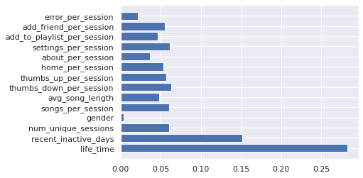

# Sparkify - Customer Churn Prediction

## Overview

Predicting customer churn using Apache Spark and Python on local machine

## Requirements

Python version and packages:

1. Python >= 3.7
2. Jupyter Notebook
3. Pyspark
4. Pandas
5. Numpy
6. Matplotlib
7. Seaborn

## Instructions

Separately download  [data: 242MB](https://video.udacity-data.com/topher/2018/December/5c1d6681_medium-sparkify-event-data/medium-sparkify-event-data.json) to project workspace

Run all the cells in  sparkify_local.ipynb

## Analysis Results

1. Performed EDA and feature engineering on 242MB of data (543,705 rows  x 18 cols )

2. Binary classification modeling and tuning resulted in best model as random forest classifier with  `numTrees`= 40 and  `maxDepth`=5 as hyper parameters and validation accuracy score below

```python
accuracy: 0.881
precision: 0.8962
recall: 0.881
f1: 0.858
AUC: 0.8276
```


3. Feature Importance




4. More detailed write-ups on the analysis can be found on this [medium post](https://medium.com/@handeasy/customer-churn-prediction-with-spark-ml-in-python-c63302aae95)

